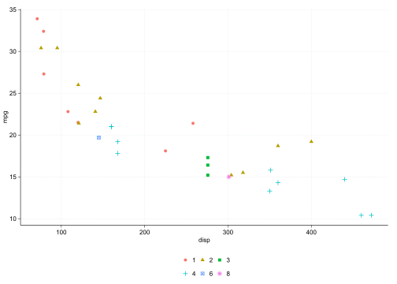
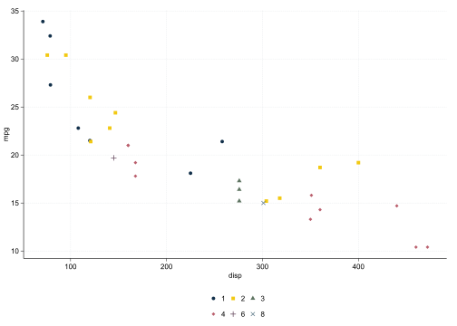
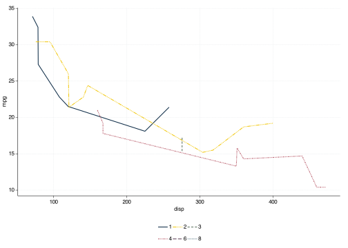
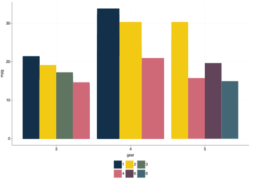
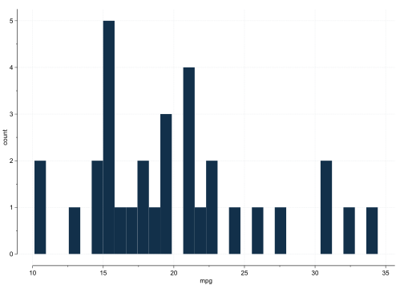
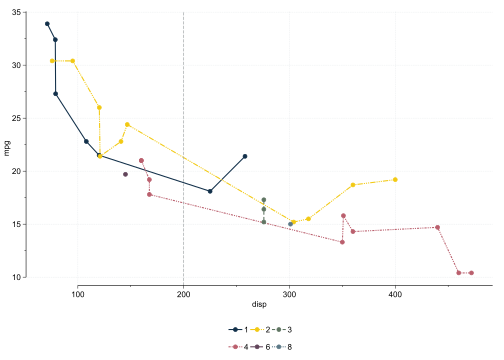

<!-- README.md is generated from README.Rmd. Please edit that file -->

# ggifau

<!-- badges: start -->

<!-- badges: end -->

The goal of ggifau is to …

## Installation

You can install the development version of ggifau like so:

``` r
# install.package("devtools")
devtools::install_github("adrianadermon/ggifau")
```

## Example

This is a basic example which shows you how to solve a common problem:

Load the package:

``` r
library(ggifau)
```

``` r
ggplot(mtcars, aes(x = disp, y = mpg, color = factor(carb), shape = factor(carb))) +
  geom_point() +
  theme_ifau()
```



``` r
ggplot(mtcars, aes(x = disp, y = mpg, color = factor(carb), shape = factor(carb))) +
  geom_point() +
  scale_colour_ifau() +
  scale_shape_ifau() +
  theme_ifau()
```



``` r
ggplot(mtcars, aes(x = disp, y = mpg, color = factor(carb), linetype = factor(carb))) +
  geom_line() +
  scale_colour_ifau() +
  scale_linetype_ifau() +
  theme_ifau()
```



``` r
ggplot(mtcars, aes(x = gear, y = mpg, fill = factor(carb))) +
  geom_col(position = position_dodge()) +
  scale_fill_ifau() +
  theme_ifau()
```



``` r
ggplot(mtcars, aes(x = mpg)) +
  geom_histogram() +
  theme_ifau()
#> `stat_bin()` using `bins = 30`. Pick better value with `binwidth`.
```



The `ggifau()` function sets the default theme, default colors, and
updates some aesthetics.

``` r
ggifau()

ggplot(mtcars, aes(x = disp, y = mpg, color = factor(carb), shape = factor(carb))) +
  geom_point()
```



``` r
ggplot(mtcars, aes(x = mpg)) +
  geom_histogram()
#> `stat_bin()` using `bins = 30`. Pick better value with `binwidth`.
```


