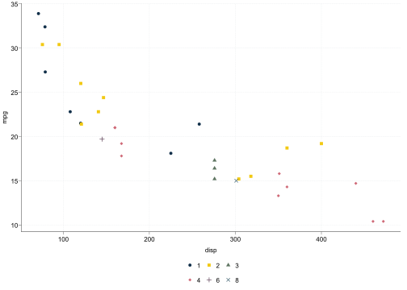
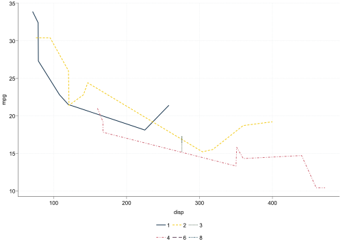

<!-- README.md is generated from README.Rmd. Please edit that file -->

# ggifau

<!-- badges: start -->

<!-- badges: end -->

The goal of ggifau is to …

## Installation

You can install the development version of ggifau like so:

``` r
# install.package("devtools")
devtools::install_github("adrianadermon/ggifau")
```

## Usage

Load the package:

``` r
library(ggifau)
```

To apply the full IFAU theme, first run

``` r
set_geoms_ifau()
```

to change the default options for some `ggplot2` geoms. Then use the
`theme_ifau()` function in your call to `ggplot2`:

``` r
ggplot(mtcars, aes(x = disp, y = mpg, color = factor(carb), shape = factor(carb))) +
  geom_point() +
  theme_ifau()
```

 This
applies some theme changes to the background, axes, text, grid and so
on. In addition, it applies custom scales for colors, marked shapes, and
lines. The following call, which applies each scale and the minimal
theme separately, is equivalent:

``` r
ggplot(mtcars, aes(x = disp, y = mpg, color = factor(carb), shape = factor(carb))) +
  geom_point() +
  scale_color_ifau() +
  scale_fill_ifau() +
  scale_shape_ifau() +
  scale_linetype_ifau() +
  theme_ifau_minimal()
```


``` r
ggplot(mtcars, aes(x = disp, y = mpg, color = factor(carb), linetype = factor(carb))) +
  geom_line() +
  scale_colour_ifau() +
  scale_linetype_ifau() +
  theme_ifau_minimal()
```



``` r
ggplot(mtcars, aes(x = gear, y = mpg, fill = factor(carb))) +
  geom_col(position = position_dodge()) +
  scale_fill_ifau() +
  theme_ifau_minimal()
```


``` r
ggplot(mtcars, aes(x = mpg)) +
  geom_histogram(bins = 30) +
  theme_ifau()
```


``` r
ggplot(mtcars, aes(x = disp, y = mpg, color = factor(carb), shape = factor(carb), linetype = factor(carb))) +
  geom_line() +
  geom_point() +
  geom_vline(aes(xintercept = 200)) +
  theme_ifau()
```


